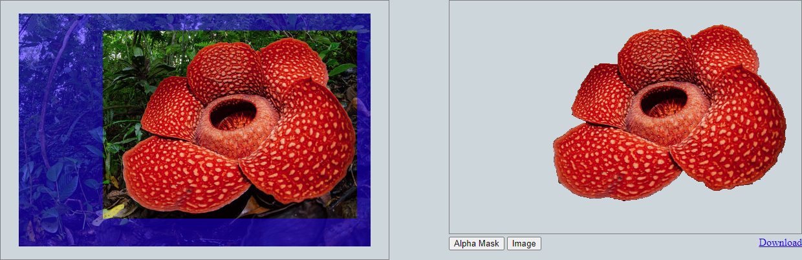
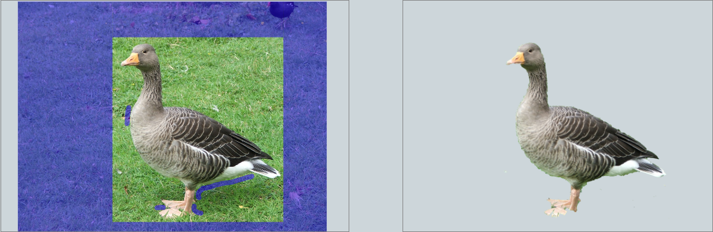
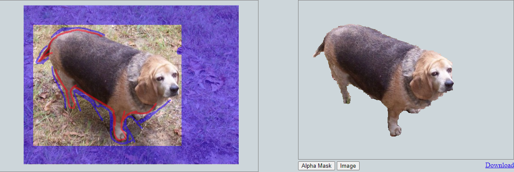

# Typescript-GrabCut

Implementation of GrabCut written from scratch in Typescript. Should run within any modern browser. Original algorithm detailed in the paper by Carsten et al (2004).

Try it out <a href="https://eatmygoose.github.io/Typescript-GrabCut/index.html">here</a>

Grabcut is a cropping algorithm that tries to extract an object from its background with minimal user input.

Its working principles are based on combining the analysis of likely colours in the foreground and background, as well as detecting edges (sharp transitions in colours) within the image. 
These 2 bundles of information are translated into flow capacities in a flow network where the result of the minimum cut is used to determine the cropped image.

</img>
</img>

  </img>
  <em>If the BG & FG are similar in colour, significant user input is required to produce a usable mask</em>

Potentially useful titbits you might find in this project - Typescript implementations of:
<ul>
<li>Dinic's max-flow/min cut algorithm</li>
<li>Boykov/Kolmogorov's max flow algorithm</li>
<li>KMeans++ and GMM clustering algorithms</li>
<li>A Bare bones matrix library (supports matrix inverse, determinants, multiplication, addition etc.)</li>
</ul>

<h4>Work in progress</h4>
<ul>
  <li>Add zoom + panning features to user touchup</li>
  <li>Downscale large images before constructing the colour GMM models</li>
  <li>Add fiddly knobs to control more parameters (i.e. no. of GMM colour clusters or Grabcut iterations)</li>
  <li><del>Support export of images without premultiplied alpha so colour data isn't lost</del></li>
  <li><del>[Optimization of graph cut] Replace Dinic's algorithm with Boykov Kolmogorov's max flow algorithm (the repeated BFS on the source node kills performance)</del></li>
</ul>
